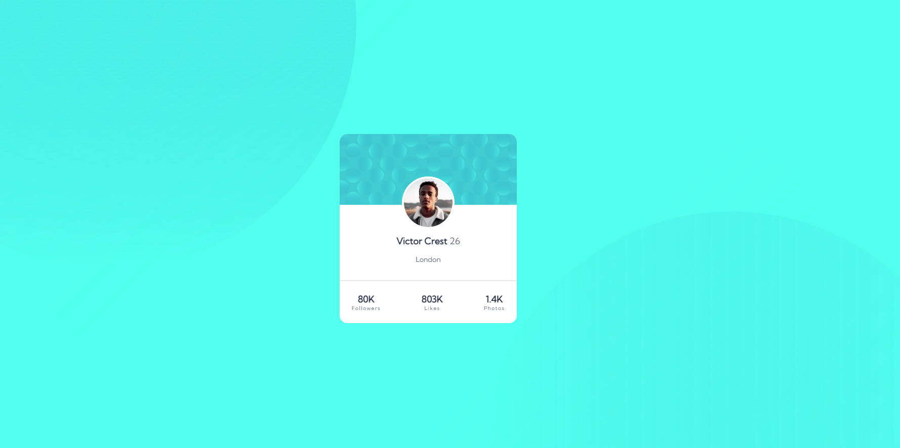

# Frontend Mentor - Profile card component solution

This is a solution to the [Profile card component challenge on Frontend Mentor](https://www.frontendmentor.io/challenges/profile-card-component-cfArpWshJ). Frontend Mentor challenges help you improve your coding skills by building realistic projects. 

## Table of contents

- [Overview](#overview)
  - [The challenge](#the-challenge)
  - [Screenshot](#screenshot)
  - [Links](#links)
- [My process](#my-process)
  - [Built with](#built-with)
  - [What I learned](#what-i-learned)

## Overview

### The challenge

- Build out the project to the designs provided

### Screenshot

### Links

- [Solution URL](https://github.com/frkanyilmaz2/profile-card)
- [Live Site URL](https://frkanyilmaz2.github.io/profile-card/)

## My process

### Built with

- Semantic HTML5 markup
- CSS custom properties
- Flexbox

### What I learned

I learned that with position absolute I can achive curved patterns. But its wobbly means that when I adjust the screen it protects its width and ratio and collapses on each other.

Edit: I found that its cause  is that images were hard coded. When I switch width to auto and height to 100% they stopped going on top of each other.

### Continued development

I may need more practice on positioning.
